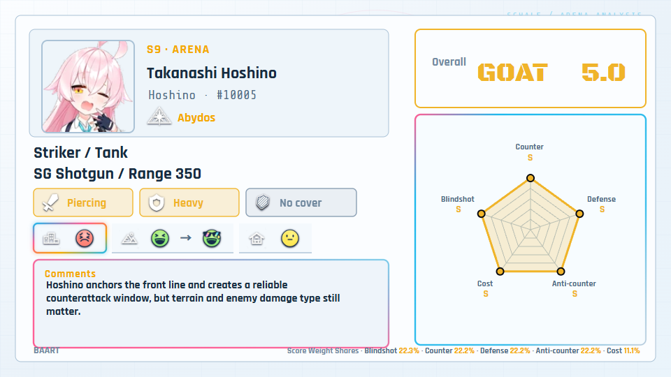

# BAART

[English](README.md) | [简体中文](README.zh-CN.md)

**BAART** means **Blue Archive Arena Rating Tool**. It is an unofficial Windows desktop tool for recording, comparing, exporting, and rendering arena/PvP ratings for Blue Archive students.

BAART combines localized SchaleDB student metadata with five custom arena rating dimensions, shared or per-student score weights, compact/full card exports, dimension ranking reports, and a Remotion-powered Video Studio for guide videos.



## Features

- Localized student search and metadata from [SchaleDB](https://schaledb.com).
- Five arena-focused rating dimensions with automatic or manual overall ratings.
- Shared-by-default score weights, fine percentage mode, and preset zero/half/full mode.
- Local autosave plus portable JSON import/export.
- Compact/full SVG and PNG card exports, batch ZIP export, and dimension ranking report PNGs.
- English and Simplified Chinese UI with dark and light themes.
- Configurable Remotion Video Studio for 16:9 arena guide previews, MP4 rendering, and PNG/JPEG frame sequences.
- Standalone Windows x64 Tauri app with a bundled Node/Remotion sidecar renderer.

## Quick Start

Requirements for development:

- Node.js 24.18.0 or compatible modern Node.js
- Rust 1.77.2 or newer
- Tauri 2 Windows build prerequisites

```powershell
npm install
npm run dev
```

Run the desktop app:

```powershell
npm run tauri dev
```

Build the Windows app, portable ZIP bundle, and installers:

```powershell
npm run tauri build
```

The build prepares local school icons, the standalone renderer runtime, Remotion modules, compositor binaries, the prebuilt composition bundle, and installers. GitHub Releases publish installer packages plus a portable Windows x64 ZIP bundle; keep `baart.exe`, `baart-node.exe`, and the `renderer/` folder together when using the portable build.

## Documentation

- [Video Studio](docs/VIDEO_STUDIO.md)
- [Rendering and Performance](docs/RENDERING.md)
- [Release Workflow](docs/RELEASE.md)

## Data and Assets

Student data, portraits, icons, school icons, and game UI assets come from [SchaleDB](https://schaledb.com) and Blue Archive. School icons are prepared into local app assets at build time so runtime display and rendering do not need to download them repeatedly.

BAART does not claim ownership of third-party game data or artwork. Example cards in this README are generated from test ratings and third-party Blue Archive/SchaleDB assets for documentation purposes.

## Disclaimer

BAART is an unofficial fan-made tool. It is not affiliated with or endorsed by Nexon Games, Yostar, or SchaleDB. Blue Archive and related assets belong to their respective owners.

## License

BAART source code is available under the [MIT License](LICENSE). The MIT license does not apply to third-party game data or artwork.
