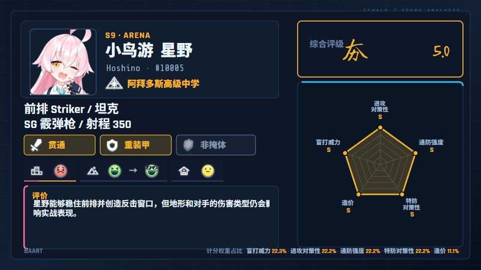

# BAART

[English](README.md) | [简体中文](README.zh-CN.md)

**BAART** 是 **Blue Archive Arena Rating Tool（蔚蓝档案竞技场评级工具）**。它是一个非官方 Windows 桌面工具，用于记录、比较、导出和渲染《蔚蓝档案》学生竞技场/PvP 评级。

BAART 将 SchaleDB 的本地化学生资料与五个竞技场评分维度结合起来，支持全体共用或单独设置的计分权重、紧凑/完整卡片导出、维度排名报告，以及基于 Remotion 的视频工作室。



## 功能

- 使用 [SchaleDB](https://schaledb.com) 的本地化学生资料进行搜索和展示。
- 五个竞技场评分维度，支持自动或手动综合评级。
- 默认全体共用权重，支持精细百分比和不计/半权重/全权重预设模式。
- 本地自动保存，并支持便携 JSON 导入/导出。
- 导出紧凑/完整 SVG 与 PNG 评级卡片，支持批量 ZIP 和维度排名报告 PNG。
- 简体中文与英文界面，支持深色和浅色主题。
- 可配置 Remotion 视频工作室，可预览 16:9 攻略视频，渲染 MP4、PNG 序列和 JPEG 序列。
- Windows x64 Tauri 独立应用，内置 Node/Remotion sidecar 渲染器。

## 快速开始

开发环境需要：

- Node.js 24.18.0 或兼容的现代 Node.js
- Rust 1.77.2 或更高版本
- Tauri 2 的 Windows 构建依赖

```powershell
npm install
npm run dev
```

运行桌面应用：

```powershell
npm run tauri dev
```

构建 Windows 应用、便携 ZIP 和安装包：

```powershell
npm run tauri build
```

构建流程会准备本地学校图标、独立渲染器运行时、Remotion 模块、合成器二进制文件、预构建合成包和安装包。GitHub Releases 会同时发布安装包和 Windows x64 便携 ZIP；使用便携版时必须让 `baart.exe`、`baart-node.exe` 和 `renderer/` 文件夹保持在一起。

## 文档

- [视频工作室](docs/VIDEO_STUDIO.md)
- [渲染与性能](docs/RENDERING.md)
- [发布流程](docs/RELEASE.md)

## 数据与素材

学生数据、立绘、图标、学校图标和游戏 UI 素材来自 [SchaleDB](https://schaledb.com) 与《蔚蓝档案》。学校图标会在构建时准备为本地应用资源，运行和渲染时不需要反复联网下载。

BAART 不主张拥有第三方游戏数据或图片素材。本 README 中的示例卡片基于测试评级和第三方《蔚蓝档案》/SchaleDB 素材生成，仅用于文档展示。

## 免责声明

BAART 是非官方同人工具，与 Nexon Games、Yostar 或 SchaleDB 无隶属或授权关系。《蔚蓝档案》及相关素材的权利归各自所有者所有。

## 许可证

BAART 源代码采用 [MIT License](LICENSE)。MIT 许可证不适用于第三方游戏数据或图片素材。
